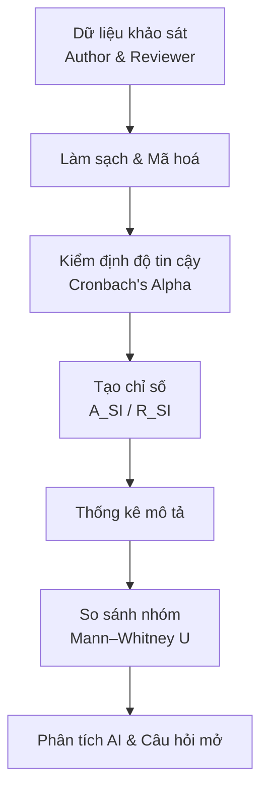

## Sơ đồ phân tích dữ liệu OJS

```mermaid
flowchart TB

A["Dữ liệu khảo sát<br/>Author & Reviewer"] --> B["Làm sạch & Mã hoá"]
B --> C["Kiểm định độ tin cậy<br/>Cronbach's Alpha"]
C --> D["Tạo chỉ số<br/>A_SI / R_SI"]
D --> E["Thống kê mô tả"]
E --> F["So sánh nhóm<br/>Mann–Whitney U"]
F --> G["Phân tích AI & Câu hỏi mở"]
```
